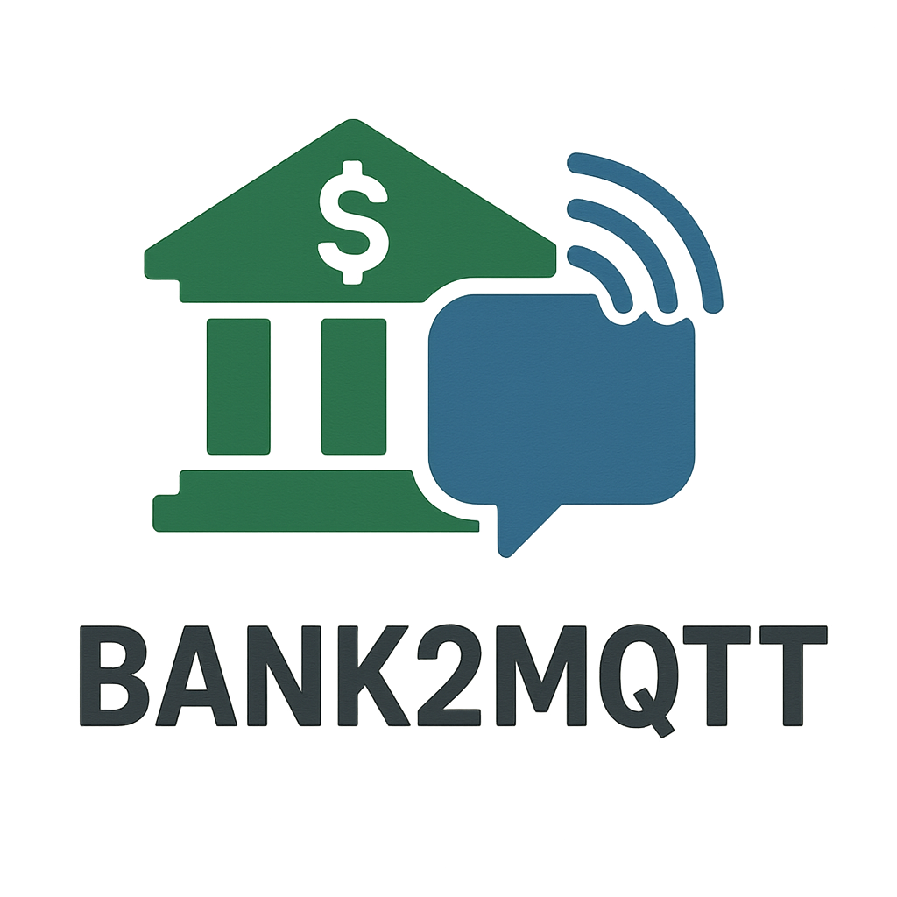

# bank2mqtt

<div align="center">
  
</div>

A Python bridge that connects bank APIs (via Powens) to MQTT for seamless home automation integration. Monitor your bank transactions in real-time and trigger automations based on financial events.

[](https://python.org)
[](LICENSE)
[](https://github.com/XavierTolza/bank2mqtt)

## ✨ Features

- **Real-time Transaction Monitoring**: Stream bank transactions as they occur
- **MQTT Integration**: Publish transaction data to MQTT topics for home automation
- **Multiple Bank Support**: Works with any bank supported by Powens API
- **Docker Support**: Easy deployment with Docker containers
- **Detailed Logging**: Configurable logging with multiple output formats

## � Quick Start with Docker (Recommended)

The easiest way to run bank2mqtt is using Docker. Choose one of the following methods:

### Method 1: Docker Compose with environment file

1. Create an environment file `.env`:
```env
POWENS_DOMAIN=your-powens-domain
POWENS_CLIENT_ID=your-client-id
POWENS_CLIENT_SECRET=your-client-secret
MQTT_HOST=192.168.1.100
MQTT_PORT=1883
MQTT_TOPIC=home/bank/transactions
MQTT_USERNAME=myuser
MQTT_PASSWORD=mypass
SLEEP_INTERVAL=3600
```

2. Create a `docker-compose.yml`:
```yaml
version: '3.8'
services:
  bank2mqtt:
    build:
      context: https://github.com/XavierTolza/bank2mqtt.git
    env_file:
      - .env
    volumes:
      - ./cache:/home/appuser/.cache/bank2mqtt
    restart: unless-stopped
    depends_on:
      - mqtt-broker

  mqtt-broker:
    image: eclipse-mosquitto:2
    ports:
      - "1883:1883"
    command: mosquitto -c /mosquitto-no-auth.conf
```

3. Start the services:
```bash
docker-compose up -d
```

### Method 2: Docker Compose with inline environment variables

Create a `docker-compose.yml`:
```yaml
version: '3.8'
services:
  bank2mqtt:
    build:
      context: https://github.com/XavierTolza/bank2mqtt.git
    environment:
      - POWENS_DOMAIN=your-powens-domain
      - POWENS_CLIENT_ID=your-client-id
      - POWENS_CLIENT_SECRET=your-client-secret
      - MQTT_HOST=mqtt-broker
      - MQTT_TOPIC=home/bank/transactions
      - SLEEP_INTERVAL=3600
    volumes:
      - ./cache:/home/appuser/.cache/bank2mqtt
    restart: unless-stopped
    depends_on:
      - mqtt-broker

  mqtt-broker:
    image: eclipse-mosquitto:2
    ports:
      - "1883:1883"
    command: mosquitto -c /mosquitto-no-auth.conf
```

### Method 3: Docker run with environment file

1. Create a `.env` file (same as Method 1)

2. Run the container:
```bash
# First, build the image from GitHub
docker build -t bank2mqtt https://github.com/XavierTolza/bank2mqtt.git

# Then run with environment file
docker run -d \
  --name bank2mqtt \
  --env-file .env \
  -v $(pwd)/cache:/home/appuser/.cache/bank2mqtt \
  --restart unless-stopped \
  bank2mqtt
```

### Environment Variables

| Variable | Description | Required | Example |
|----------|-------------|----------|---------|
| `POWENS_DOMAIN` | Your Powens API domain | Yes | `your-bank-domain` |
| `POWENS_CLIENT_ID` | Powens client ID | Yes | `12345` |
| `POWENS_CLIENT_SECRET` | Powens client secret | Yes | `your-secret-key` |
| `POWENS_CALLBACK_URL` | Callback URL for OAuth | No | `https://example.com/callback` |
| `MQTT_HOST` | MQTT broker hostname | Yes | `192.168.1.100` |
| `MQTT_PORT` | MQTT broker port | No | `1883` |
| `MQTT_TOPIC` | MQTT topic for transactions | Yes | `home/bank/transactions` |
| `MQTT_USERNAME` | MQTT username | No | `myuser` |
| `MQTT_PASSWORD` | MQTT password | No | `mypass` |
| `SLEEP_INTERVAL` | Polling interval in seconds | No | `3600` |

### Monitoring and Logs

View the application logs:
```bash
# With docker-compose
docker-compose logs -f bank2mqtt

# With docker run
docker logs -f bank2mqtt
```

### Building from Source (Optional)

If you prefer to build the Docker image locally:
```bash
git clone https://github.com/XavierTolza/bank2mqtt.git
cd bank2mqtt
git checkout v2
docker build -t bank2mqtt .
```

Or build directly from GitHub without cloning:
```bash
docker build -t bank2mqtt https://github.com/XavierTolza/bank2mqtt.git
```

## 📊 Transaction Data Format

Each transaction published to MQTT contains:

```json
{
  "id": 123456,
  "id_account": 789,
  "date": "2024-01-15",
  "amount": -50.25,
  "label": "GROCERY STORE XYZ",
  "raw": "CARD PAYMENT GROCERY STORE XYZ",
  "category": "shopping",
  "last_update": "2024-01-15T10:30:00Z",
  "account": {
    "id": 789,
    "name": "My Checking Account",
    "balance": 1234.56,
    "type": "checking",
    "currency": "EUR",
    "disabled": false
  }
}
```

## 🛠️ Development Setup

If you want to contribute to the project or customize it for your needs:

### Prerequisites

- Python 3.9 or higher
- A Powens API account with client credentials
- MQTT broker for testing

### Installation

```bash
# Clone the repository
git clone https://github.com/XavierTolza/bank2mqtt.git
cd bank2mqtt

# Create virtual environment
python -m venv venv
source venv/bin/activate  # On Windows: venv\Scripts\activate

# Install in development mode
pip install -e .
```

### Configuration

Set up your environment variables:
```bash
# Create .env file
cat > .env << EOF
POWENS_DOMAIN=your-powens-domain
POWENS_CLIENT_ID=your-client-id
POWENS_CLIENT_SECRET=your-client-secret
MQTT_HOST=your-mqtt-broker-ip
MQTT_TOPIC=home/bank/transactions
EOF
```

### Command Line Interface

bank2mqtt provides a comprehensive CLI for development and testing:

#### Authentication Commands

```bash
# Authenticate with Powens API
bank2mqtt authenticate

# Get a temporary connection code
bank2mqtt get-temp-code

# Get the Powens Connect webview URL for account management
bank2mqtt get-connect-url
```

#### Account Management

```bash
# List active bank accounts
bank2mqtt list-accounts

# List all accounts (including disabled)
bank2mqtt list-accounts --all
```

#### Transaction Monitoring

```bash
# List recent transactions
bank2mqtt list-transactions

# List transactions for a specific account
bank2mqtt list-transactions --account-id 12345

# List transactions with date filtering
bank2mqtt list-transactions --date-from 2024-01-01 --date-to 2024-01-31

# Limit number of transactions
bank2mqtt list-transactions --limit 10
```

#### Continuous Monitoring

```bash
# Start continuous transaction monitoring
bank2mqtt run

# Reset the last processed transaction date
bank2mqtt reset-last-date
```

### Programmatic Usage

```python
from bank2mqtt.client import PowensClient
from bank2mqtt.handlers.mqtt import MqttHandler

# Initialize client
client = PowensClient.from_env()
client.authenticate()

# Get accounts
accounts = client.list_accounts()
print(f"Found {len(accounts)} accounts")

# Get recent transactions
transactions = client.list_transactions(limit=10)
for tx in transactions:
    print(f"Transaction: {tx['amount']} on {tx['date']}")

# Use MQTT handler
with MqttHandler.from_env() as mqtt:
    for tx in transactions:
        mqtt.process_transaction(tx)
```

### Code Quality

```bash
# Format code
black bank2mqtt/
isort bank2mqtt/

# Lint code
flake8 bank2mqtt/

# Type checking
mypy bank2mqtt/
```

### Logging Configuration

bank2mqtt uses Loguru for comprehensive logging. Configure via environment variables:

| Variable | Description | Default | Examples |
|----------|-------------|---------|-----------|
| `BANK2MQTT_LOG_LEVEL` | Minimum log level | `INFO` | `DEBUG`, `WARNING`, `ERROR` |
| `BANK2MQTT_LOG_FILE` | Log file name | `bank2mqtt.log` | `app.log`, `/tmp/bank2mqtt.log` |
| `BANK2MQTT_LOG_FORMAT` | Log format | `default` | `simple`, `detailed`, `json` |
| `BANK2MQTT_LOG_ROTATION` | File rotation | `10 MB` | `100 MB`, `daily` |
| `BANK2MQTT_LOG_RETENTION` | Log retention | `1 month` | `7 days`, `1 year` |

See [LOGGING.md](LOGGING.md) for detailed logging configuration.

## 🤝 Contributing

1. Fork the repository
2. Create a feature branch (`git checkout -b feature/amazing-feature`)
3. Commit your changes (`git commit -m 'Add amazing feature'`)
4. Push to the branch (`git push origin feature/amazing-feature`)
5. Open a Pull Request

## 📄 License

This project is licensed under the MIT License - see the [LICENSE](LICENSE) file for details.

## 📞 Support

- 📧 Email: tolza.xavier@gmail.com
- 🐛 Issues: [GitHub Issues](https://github.com/XavierTolza/bank2mqtt/issues)
- 💬 Discussions: [GitHub Discussions](https://github.com/XavierTolza/bank2mqtt/discussions)

---

Made with ❤️ by [Xavier TOLZA](https://github.com/XavierTolza)
